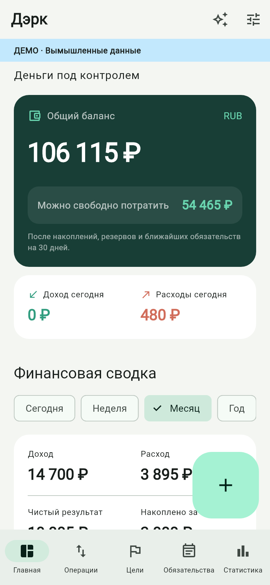

# Дэрк Финансы

Android MVP личного финансового помощника на Flutter. Полный исходный проект: работающий офлайн-учёт, финансовая панель, CRUD, диаграммы, цели, обязательства, импорт выписок, зашифрованные резервные копии, BankProvider, FinanceAssistantAPI и локальный MCP-сервер.

**Статус:** APK 0.1.1+2 собран в [GitHub Actions](https://github.com/derkin01020304-eng/fonans/actions/runs/34163728654). Пройдены 44 Flutter-теста и нативная проверка SQLCipher/Keystore на эмуляторе Android API 35. APK доступен в артефакте `derk-finance-apk`; точные результаты и контрольная сумма — в [VERIFICATION.md](VERIFICATION.md).

**Версия 0.1.1+2:** исправлен Android-вызов настройки SQLite при запуске, разрешены скриншоты, добавлен копируемый код ошибки. Подробности — [CHANGELOG.md](CHANGELOG.md).

## Быстрый запуск

Проверенная для Dart-кода версия: **Flutter 3.35.7 / Dart 3.9.2**. Для сборки Android нужны JDK 17, Android SDK Platform 36, Build Tools 36.0.0 и подключённый телефон или эмулятор Android 6.0+ (API 23+).

1. Установите [Flutter](https://docs.flutter.dev/install/archive) и [Android Studio](https://developer.android.com/studio).
2. Добавьте Flutter в PATH. В SDK Manager установите Android SDK Platform 36, Android SDK Command-line Tools и Android SDK Build-Tools 36.0.0.
3. Распакуйте архив, откройте терминал в папке `derk_finance` и выполните:

    flutter doctor -v
    flutter doctor --android-licenses
    flutter pub get
    dart run build_runner build --delete-conflicting-outputs
    flutter devices
    flutter run -d DEVICE_ID

Замените `DEVICE_ID` идентификатором телефона или эмулятора. Первый запуск требует интернета для зависимостей; само приложение работает офлайн.

При запуске создайте отдельный PIN приложения из 6–12 цифр. Включать банк или AI для обычного учёта не нужно. Добавьте начальные остатки: **Настройки → Счета и баланс**. Для изучения интерфейса в пустом учёте: **Настройки → Загрузить демо**. Появятся 42 дня вымышленных операций, цели, кредит, долги и платежи. Выход из демо восстанавливает состояние до его загрузки; изменения внутри демо удаляются.

## Сборка APK

Из корня проекта:

    flutter pub get
    dart run build_runner build --delete-conflicting-outputs
    flutter analyze --no-fatal-infos
    flutter test
    flutter build apk --release

Результат: `build/app/outputs/flutter-apk/app-release.apk`.

Установка:

    adb install -r build/app/outputs/flutter-apk/app-release.apk

Есть готовые сценарии `scripts/build_apk.sh` и `scripts/build_apk.ps1`. На Linux для тестовой SQLite установите `libsqlite3-dev`; на macOS SQLite обычно поставляется с системой. Windows-тесты используют библиотеку из sqflite_common_ffi.

Без `android/key.properties` release-вариант подписывается **отладочным ключом** для локальной установки. Для распространения создайте свой ключ по [официальной инструкции Flutter](https://docs.flutter.dev/deployment/android#sign-the-app), скопируйте `android/key.properties.example` в `android/key.properties` и заполните локальные значения. Ключ и пароли не добавляйте в git.

Для Google Play:

    flutter build appbundle --release

Workflow `.github/workflows/android.yml` выполняет анализ, тесты, нативную проверку SQLCipher/Keystore на эмуляторе Android API 35 и сборку APK в GitHub Actions, затем сохраняет APK как artifact на 14 дней. Проверенный запуск: [34163728654](https://github.com/derkin01020304-eng/fonans/actions/runs/34163728654). Для повторной сборки откройте Actions → Android MVP → Run workflow.

## Что реализовано

| Область | Возможности |
|---|---|
| Главная | Баланс, доступные деньги, резерв, накопления, доход и расход сегодня, сводка выбранного периода, долги, кредиты, ближайшие платежи |
| Операции | Доходы и расходы со всеми полями, рабочее время, категории и подкатегории, поиск, фильтр дат и категорий, изменение и удаление обычных операций |
| Счета | Карты, банковские и накопительные счета, наличные, виртуальные счета, кошельки; начальный остаток и отдельный резерв |
| Переводы | Два собственных счёта одной валюты; не входят в доходы и расходы |
| Цели и накопления | Создание и изменение целей, прогресс, дневной/недельный/30-дневный план, пополнение и снятие, история накоплений |
| Долги | Оба направления, остаток, срок, статус, частичные возвраты, история, процент погашения |
| Кредиты | Ставка, сроки, основной долг, проценты, плановый и досрочный платёж, приближённая оценка переплаты |
| Платежи | Разовые, еженедельные, ежемесячные и ежегодные обязательства, резерв, необходимая сумма в день и неделю |
| Статистика | Расходы по категориям; доходы, расходы, баланс, накопления и долги по дням/неделям/месяцам; интерактивный выбор точки графика |
| Быстрый ввод | Кнопка «+» и фразы «250 еда», «+3000 работа», «500 транспорт» с проверкой перед сохранением |
| Выписки | CSV UTF-8, XLSX, OFX/QFX; распознавание распространённых заголовков, предпросмотр ошибок, корректировка категории и собственного перевода, дедупликация |
| Банки | Абстракция BankProvider, рабочий mock, OAuth2 Authorization Code + PKCE через AppAuth, адаптер нормализованного официального API |
| AI/MCP | Локальный помощник с разбором фраз, FinanceAssistantAPI, 16 инструментов с JSON Schema, разрешения по инструментам, подтверждение или временный токен для записи |
| Защита | SQLCipher, ключ в защищённом хранилище Android Keystore, PIN, биометрия, блокировка в фоне и через 2 минуты бездействия |
| Резервные копии | AES-256-GCM, парольная KDF PBKDF2, проверка целостности и атомарное восстановление |
| Экспорт | CSV, XLSX, JSON; все операции выбранной валюты, период и категория |
| Напоминания | Android AlarmManager, объединение по дню, без сумм и имён на экране блокировки |
| Темы | Material 3, светлая, тёмная и системная тема; русская локализация |

## Правила учёта

Все суммы хранятся целыми числами в минимальных денежных единицах: **450,50 ₽ = 45050**. RUB, USD и EUR учитываются отдельно. Валютная конвертация и курсы не реализованы.

Баланс счёта = начальный остаток + входящие движения − исходящие. Между своими счетами и в накопления деньги переводятся без дохода или расхода. Остаток долга и движение денег при погашении записываются одной транзакцией SQLite.

Тело кредита и возврат долга не входят в расходы. Проценты по кредиту входят в расходы отдельной операцией. При создании уже существующего кредита баланс не увеличивается. В форме нового долга можно явно учесть получение или выдачу денег.

«Можно свободно потратить» = общий баланс − накопления − отдельные резервы − резервы платежей − ещё не обеспеченные обязательства за ближайшие 30 дней, включая просроченные. Учитываются все повторения платежа в горизонте, а резерв снимается только с первого. Резерв счёта и резерв платежа — разные назначения: одну сумму не нужно вручную указывать дважды. Оценка может быть отрицательной; неизвестные приложению расходы в неё не входят.

Сутки, неделя с понедельника, месяц и год считаются до конца текущего дня; «всё время» — от первой операции. Сравнение дохода выполняется с непосредственно предшествующим интервалом такой же длины в календарных днях. При нулевой базе процент не вычисляется. Средний доход в час использует только доходы с указанным рабочим временем.

Баланс на графике начинается с указанного начального остатка. История до начала ведения учёта не восстанавливается автоматически. Общая переплата кредита — оценка по фиксированной месячной ставке без страховок, изменения ставки и банковских комиссий.

## Банки и импорт

**Настройки → Банки и импорт**:

- Демо-банк создаёт отдельный тестовый счёт и две фиксированные операции. Повторная синхронизация не добавляет дублей.
- Реальному провайдеру нужны выданные банком OAuth Client ID, Discovery URL, scopes, зарегистрированный redirect URI и адаптер официального API. Никакой реальный банк не подключён автоматически.
- Банк запрашивает пароль только на своей странице авторизации. Приложение не содержит поля для банковского пароля и не использует его для синхронизации.
- Синхронизация выполняется вручную. Первичная загрузка устанавливает начальный остаток из банковского снимка и полученной истории. Последующие снимки сохраняются отдельно, не переписывая локальный журнал.
- Перед импортом подтвердите счёт, валюту, категории и собственные переводы. В файл-примере `assets/sample_statement.csv` три тестовые операции.

Контракт адаптера и правила стабильных идентификаторов: [docs/BANKS.md](docs/BANKS.md).

## Подключение AI

Встроенный помощник работает локально: распознаёт поддержанные финансовые вопросы и короткие команды. Это детерминированный парсер, а не встроенная облачная языковая модель. Перед чтением он запрашивает доступ, перед записью показывает форму подтверждения.

Для подключения внешнего AI используется FinanceAssistantAPI через MCP. Приложение не отправляет данные облачному AI само. Подключённый клиент получает только выбранные разрешения. Полная инструкция для USB, HTTP и stdio: [docs/MCP.md](docs/MCP.md).

API-ключ облачной модели, если он нужен вашему внешнему AI-клиенту, хранится у этого клиента или на доверенном backend. В APK ключей нет.

## Проверки

    flutter test
    flutter test integration_test/android_storage_test.dart -d DEVICE_ID
    flutter analyze --no-fatal-infos

Первой командой запускаются тесты расчётов, SQLite-транзакций, импорта, резервных копий, AI-разрешений, HTTP MCP и виджетов. Второй проверяется нативная SQLCipher/Keystore на Android в отдельной временной базе. Для неё нужен телефон или эмулятор.

При изменении моделей:

    dart run build_runner build --delete-conflicting-outputs

Сгенерированный `lib/domain/models.g.dart` включён. `pubspec.lock` фиксирует зависимости.

## Структура

| Каталог | Назначение |
|---|---|
| `lib/core` | Деньги и календарные функции |
| `lib/domain` | JSON-модели, интерфейс репозитория, аналитика |
| `lib/data` | SQLCipher/SQLite, репозиторий, демо-набор |
| `lib/presentation` | Riverpod, GoRouter, экраны, формы, диаграммы и блокировка |
| `lib/services` | Категоризация, импорт, экспорт, шифрование, AI API, Android-каналы |
| `lib/integrations/banks` | BankProvider, mock, OAuth-провайдер, синхронизация |
| `lib/integrations/mcp` | HTTP-сервер, разрешения, валидатор схем |
| `assets` | SQL-миграции, JSON Schema инструментов, пример выписки |
| `android` | Gradle-проект, Kotlin-мост, уведомления, Android Manifest |
| `test` | Автоматические тесты логики и интерфейса |
| `integration_test` | Нативная проверка SQLCipher и Keystore |
| `scripts` | Проверка, сборка APK, stdio-мост MCP |
| `docs` | Архитектура, интеграции, безопасность, изображения интерфейса |

Архитектура и база: [docs/ARCHITECTURE.md](docs/ARCHITECTURE.md). Защита и восстановление: [docs/SECURITY.md](docs/SECURITY.md).

## Границы MVP

- Реальный банк требует отдельной интеграции и разрешений банка; mock не является банковским подключением.
- PDF/OCR-импорт не реализован: интерфейс объясняет необходимость адаптера формата банка. CSV с нестандартной кодировкой предварительно сохраните в UTF-8; XLSX без распознаваемых заголовков требует преобразования.
- Импорт уведомлений — дополнительный экспериментальный канал, только для явно указанных пакетов, при открытом экране интеграций и разблокированном приложении. Каждая операция подтверждается вручную. Доступ Android пользователь включает сам. При подготовке публикации требуется проверить применимые правила магазина.
- Нет фонового банковского polling, облачной синхронизации, remote MCP, встроенного облачного LLM, прогнозирования расходов нейросетью и OCR.
- Стабильный банковский ID обеспечивает надёжную дедупликацию. Без ID используется отпечаток полей с учётом повторений; перекрывающиеся выписки и разные источники могут требовать ручной проверки. Возврат покупки не связан автоматически с первоначальным расходом.
- Удаление и редактирование связанных проводок погашений и накоплений ограничено для сохранения истории. Предусмотрены частичные погашения и обратное движение накоплений; произвольное исправление уже проведённого погашения в MVP не добавлено.
- Напоминания неточные по времени: Android может их отложить. План обновляется при запуске и изменении данных; приложение не хранит суммы в системных уведомлениях.
- Android-сборка, биометрия, OAuth-переход, системный файловый диалог, reboot-напоминания и listener требуют проверки на реальном устройстве. См. VERIFICATION.md.
